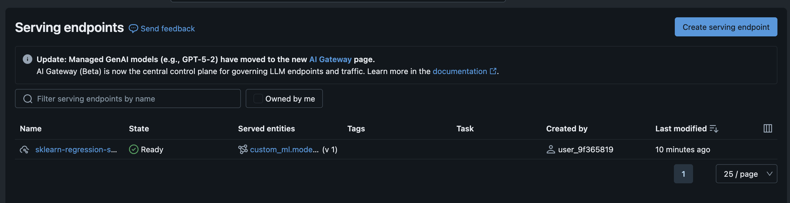
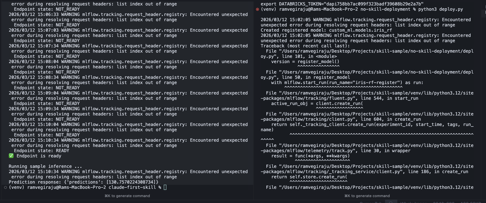

# skill-sample

## [Video/Guide](https://www.youtube.com/watch?v=oLSqUqm7jqI)

This repo compares two ways to deploy an ML model to a Databricks Model Serving endpoint:

- `claude-first-skill/`: workflow with a Claude Code skill (`databricks-model-serving-ep`) guiding the deployment path.
- `no-skill-deployment/`: workflow without a skill, using manual scripts and lower-level wiring.

The goal is to show how a skill can reduce ambiguity and make endpoint deployment more consistent.

## What This Project Demonstrates

- Skill-assisted deployment of a sample scikit-learn model to Databricks Model Serving.
- Manual deployment of a different sample scikit-learn model without the skill.
- Operational differences in endpoint creation, registration flow, and invocation style.

## Directory Overview

### `claude-first-skill/` (skill-enabled)

- `train.py`: trains a `LinearRegression` model on synthetic data and registers it to Unity Catalog (`custom_ml.models.sklearn_regression_sample`) via MLflow.
- `deploy.py`: creates a Databricks serving endpoint (`sklearn-regression-sample-ep`), waits for readiness, and runs a sample prediction.
- `.claude/skills/databricks-model-serving-ep/SKILL.md`: skill instructions/playbook used to guide the workflow.

### `no-skill-deployment/` (manual)

- `model.py`: trains an Iris `RandomForestClassifier` and saves it as an MLflow model artifact (`iris_rf_model/`).
- `deploy.py`: manually registers the model in Unity Catalog (`custom_ml.models.iris_rf`) and creates/updates endpoint `iris-rf-endpoint` with the Databricks SDK.
- `invoke.py`: sends inference requests via raw REST to the serving endpoint.

## Quick Comparison

- **Guidance**: skill-assisted workflow has an explicit, reusable deployment playbook; manual workflow relies on handwritten orchestration.
- **API surface**: skill path uses MLflow deployment client end-to-end; manual path mixes MLflow + Databricks SDK + direct REST.
- **Flow shape**: skill path is train -> deploy -> predict in a tighter loop; manual path is train -> register/deploy -> separate invoke step.

## Prerequisites

- Python 3.10+ (tested with local `venv` setup)
- Databricks workspace access
- Environment variables:
  - `DATABRICKS_HOST`
  - `DATABRICKS_TOKEN`
- Unity Catalog objects available/authorized for:
  - `custom_ml.models.sklearn_regression_sample`
  - `custom_ml.models.iris_rf`

## Local Environment Setup

Create and activate a virtual environment from the repo root:

```bash
python -m venv .venv
source .venv/bin/activate
```

Install the minimum libraries required to run training and deployment scripts:

```bash
pip install --upgrade pip
pip install mlflow scikit-learn
```

For full execution of both flows (Databricks endpoint management + invocation), install:

```bash
pip install databricks-sdk requests pandas numpy
```

## How To Run

### 1) Skill-enabled flow

From `claude-first-skill/`:

```bash
python train.py
python deploy.py
```

### 2) No-skill flow

From `no-skill-deployment/`:

```bash
python model.py
python deploy.py
python invoke.py
```

## Result Screenshots

### Successful endpoint creation



### No-skill deployment failure example



## Takeaway

The skill-enabled path provides stronger structure around model registration and endpoint deployment, which helps reduce setup friction and failure-prone manual steps when creating Databricks Model Serving endpoints.

## Additional Resources / Credits

- Claude Code Skills documentation: [https://code.claude.com/docs/en/skills](https://code.claude.com/docs/en/skills)
- Databricks example skills repository: [https://github.com/databricks/app-templates/tree/main/.claude/skills](https://github.com/databricks/app-templates/tree/main/.claude/skills)
